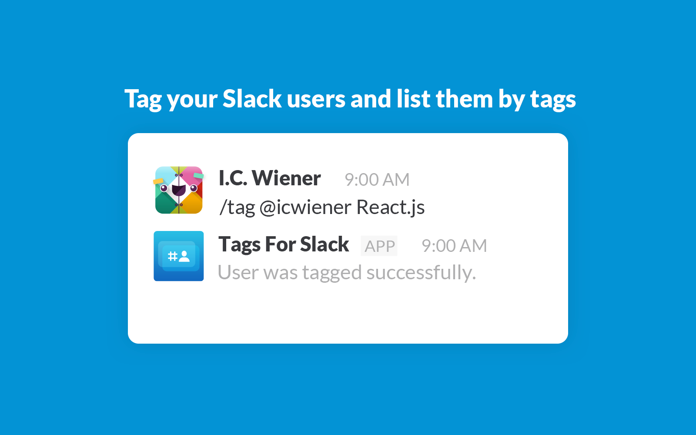

# Tags For Slack

Tag slack users and list by tag

## Tag your Slack users

Tags For Slack is a simple set of slash commands that lets you tag people.

Tag people with skills that they possess and list them by those skills. Additionally list skills that a given person has.

Available commands are:
- `/tag @username tag`
- `/list-by-tag tag`
- `/list-by-user @username`
- `/untag @username tag`

You can also work with multiple tags (comma separated) and users:
- `/tag @username1 @username2 tag1, tag2`
- `/untag @username1 @username2 tag1, tag2`

Give it a go and start tagging.

## Support

For issues and support please contact: <karolsojko@nuordo.com>
